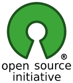

### Sobre mi Podcast

Esta es la página principal del Podcast de uGeek donde a ratos os explico mis progresos, opiniones y un poco de todo del mundo de la tecnología. Comparto mis conocimentos, sin ser experto, por si os puede ser de ayuda o inspiraros.  

Los podcast los podréis escuchar mediante mi [Feed](http://feeds.feedburner.com/ugeek), esta web [ugeekpodcast.tk](https://angelbcn.github.io/ugeek/) y la web de [Infosertec.com.ar](http://infosertec.com.ar), donde di covertura en el Mobile World Congress 2017 y donde amenudo publico también alguno de mis artículos. Os recomiendo igualmente el podcast [RadioGeek](http://www.ivoox.com/podcast-radiogeek_sq_f129471_1.html)

Gracias precisamente a la inspiración que me dió [inclusa](https://github.com/inclusa) y al acompañamiento de [Laura](https://github.com/lormez16) en el proceso de creación de esta [GitHub Pages](https://pages.github.com/), hoy estoy aquí abandonando [Blogger](https://www.blogger.com), por una solución 100% Open Source y totalmente libre.  

Periódicamente me cruzo con mi amigo Frank de [bateria2x100](https://feedpress.me/bateria2x100) dentro de mi podcast, apareciendo tambien en el suyo, creando un nuevo concepto antes nunca visto en el mundo del podcast, el "Crossover" y debatimos diferentes puntos de vista de las mismas cosas, compartiendo una charla agradable.  

Últimamente también ha habido un nuevo Crossover con el [MosqueteroWeb](https://www.spreaker.com/user/8370551/episodes/feed) y "Trissover".  

Para que después digan que todo en el mundo del podcast, ya está inventado. Lo que no se nos ocurra a mi y a Frank, jajaja.  

Desde la web podréis acceder también a todos los audios. Pero para que os sea más simple, os recomendaría que os instalarais una aplicación de podcast, os suscribais a los Feeds y tal como lleguen nuevas publicaciones, podréis escucharlas.  

<iframe src="http://us1.rssfeedwidget.com/getrss.php?time=1491832612045&amp;x=http%3A%2F%2Fchannel2rss.bitmachine.org%2Fatom%2Ffrases&amp;w=300&amp;h=500&amp;bc=333333&amp;bw=1&amp;bgc=transparent&amp;m=20&amp;it=true&amp;t=(default)&amp;tc=333333&amp;ts=15&amp;tb=transparent&amp;il=true&amp;lc=0000FF&amp;ls=14&amp;lb=false&amp;id=true&amp;dc=333333&amp;ds=14&amp;idt=true&amp;dtc=284F2D&amp;dts=12" border="0" hspace="0" vspace="0" marginwidth="0" marginheight="0" style="border:0; padding:0; margin:0; width:300px; height:500px;" id="rssOutput" frameborder="no">Reading RSS Feed ...</iframe>

<a href="http://www.rssfeedwidget.com">rss feed widget</a>&nbsp; 

