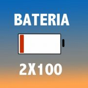

## Sobre mi Podcast

Esta es la página principal del Podcast de uGeek donde a ratos, os explico mis progresos, opiniones y un poco de todo del mundo de la tecnología. Comparto mis conocimentos, sin ser experto, por si os puede ser de ayuda o inspiraros.
Periodicamente me cruzo con mi amigo Frank de [bateria2x100](https://feedpress.me/bateria2x100) dentro de mi podcast, apareciento tambien en el suyo, creando un nuevo concepto antes nunca visto en el mundo del podcast, el "Crossover" y debatimos diferente puntos de vista de las mismas cosas, compartiendo una charla agradable.

Últimamente tambien ha habido un nuevo Crossover con el [MosqueteroWeb](https://www.spreaker.com/user/8370551/episodes/feed) y "Trissover".

Para que despues digan que todo en el mundo del podcast, ya está inventado. Lo que no so se nos ocurra a mi y a Frank, jajaja.

Desde la web podreis acceder también a todos los audios. Pero para que os sea mas simple, os recomendaría que os instalarais una aplicación de podcast, os suscribais a los Feeds y tal como lleguen nuevas publicaciones, podrais escucharlas.

